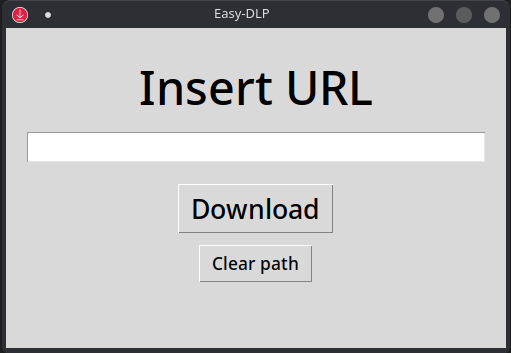
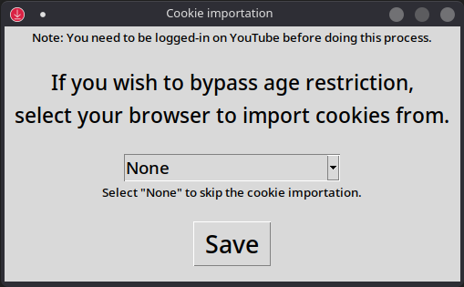

# Easy-DLP
Easy-DLP is a clean and simple GUI wrapper for **YT-DLP**. Download videos easily with browser cookie support. 

This application is but a humble wrapper coded in Python, using only three Python standard libraries: Tkinter, Subprocess and OS.

>[!CAUTION]
>By using this GUI, you agree to abide by local copyright laws. This project does not condone or encourage the unauthorized distribution of copyrighted material.

## Table of Contents
- [Preview](#preview)
- [Current Features](#current-features)
- [Requirements](#requirements)
- [How to Use](#how-to-use)
- [Roadmap](#roadmap)
- [Contributing](#contributing)

## Preview
 

## Current Features
- Simple and easily manageable GUI
- Browser cookie import (for age-restricted content)
- Remembers the last YT-DLP binary location (simple .txt soft-cache system)
- Error handling with user-friendly message boxes
- No external libraries required

## Requirements
For now, you need Windows 8 or newer as it is the minimum requirement to run YT-DLP. For Linux users, check the [roadmap](#roadmap).  
More importantly, you will also need a [YT-DLP](https://github.com/yt-dlp/yt-dlp) binary.  
If you plan on using the source code version, you must install the [latest Python version](https://www.python.org/downloads/). 🐍

## How to Use
1. Download the latest release of this project;
2. Execute the binary (.exe file);
3. Paste your YT-DLP file path in the "YT-DLP Path Directory Cache" window. For example, "C:/Users/YourName/Downloads/" if your YT-DLP binary is located in the 'Downloads' folder;
4. If you wish to download an age-restricted video from YouTube, log into your YouTube account and select your browser in the drop-down menu, clicking save after the process. Leave the selector at "None" if you don't need cookie importation;
5. Insert the URL of the video you're going to download and press "Download".

>[!TIP]
> You are able to clear the YT-DLP file path you provided by clicking "Clear path", doing this will close the application, 
  and will generate a new cache file once you open it up again. 
> If you are importing cookies, it MIGHT be preferable to close your browser before downloading any video.

## Roadmap
- Migrate to CustomTkinter;
- Add threading and a progress bar;
- Linux support;
- Playlist support;
- Add a settings tab;
- Themes;
- Additional path verification for better integrity;

## Contributing
✨ Contributions are always welcome! ✨  

### How to Contribute:
*   **Report Bugs**: Open an issue with detailed steps to reproduce.
*   **Suggest Features**: Open an issue to discuss your idea.
*   **Contribute Directly to the Code**: 
    I. Fork the repository; 
    II. Create a new branch; 
    III. Make your changes and commit; 
    IV. Push to the branch; 
    V. Open a Pull Request; 
    VI. Kindly wait for approval. ;) 
 
Thank you for reading!
