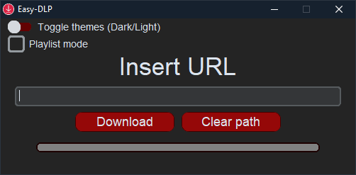
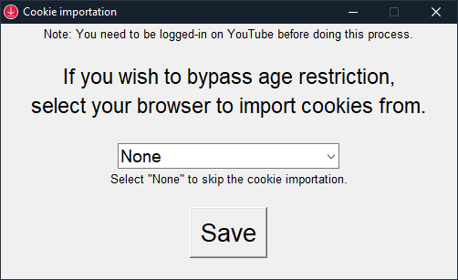
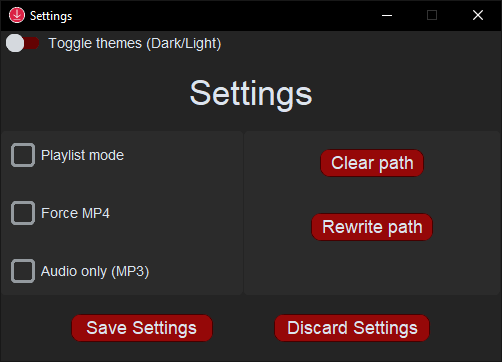

# Easy-DLP
Easy-DLP is a clean and simple GUI wrapper for **YT-DLP**. Download videos easily with cookie import support.<br>
This application is but a humble Python wrapper, using the following libraries: CustomTkinter, CTkMessagebox, PIL, bs4, urllib, subprocess, requests, threading, os and sys.<br>
The Windows [binaries](https://github.com/Guilherme-A-Garcia/Easy-DLP/releases) are currently compiled with [Nuitka](https://nuitka.net/), along with the Linux ones,<br> which are turned into AppImages, all of that streamlined through my tool [AutoAppImage](https://github.com/Guilherme-A-Garcia/AutoAppImage).

>[!CAUTION]
>By using this GUI, you agree to abide by local copyright laws. This project does not condone or encourage the unauthorized distribution of copyrighted material.

## Table of Contents
- [Preview](#preview)
- [Current Features](#current-features)
- [Requirements](#requirements)
- [How to Use](#how-to-use)
- [Using the Source Code](#using-the-source-code)
- [Roadmap](#roadmap)
- [How to Contribute](#how-to-contribute)

## Preview
<br>
<br>


## Current Features
- Simple and easily manageable GUI
- Browser cookie import (for age-restricted content)
- Remembers the downloads directory (simple .txt soft-cache system)
- Error handling with user-friendly message boxes
- Dark/Light theme switch
- Binaries for both Windows and Linux
- Support for downloading playlists
- Settings centralized in a window
- Automatic binary updates
- YT-DLP API integration

## Requirements
First and foremost, you will need [FFMPEG](https://www.ffmpeg.org/download.html) and a JS runtime from this list:
* [QuickJS](https://bellard.org/quickjs/)
* [Bun](https://bun.com/)
* [Node](https://nodejs.org/en)
* [Deno](https://deno.com/)

If you use Windows, Windows 8 (or newer) is needed, as it is the minimum requirement to be able to use the YT-DLP API.<br>

Keep in mind that sometimes it's tricky to fetch cookies due to rigid browser security and constant security measures in certain websites..<br>

And most importantly, don't forget to grant executable permissions to the .AppImage binary with `chmod +x`!<br>

If you plan on using the source code version, you must install the [latest Python version](https://www.python.org/downloads/). 🐍

## How to Use
1. Download the latest release of this project;<br>
2. Execute the .exe binary (or the .AppImage if you are using Linux);<br>
3. Paste your preferred download destination in the "Download Directory Cache" window. For example, "C:/Users/YourName/Downloads/";<br>
4. If you wish to download an age-restricted video from YouTube, log into your YouTube account and select your browser in the drop-down menu, clicking save after the process. Leave the selector at "None" if you don't need cookie importation;<br>
5. Insert the URL of the video you're going to download and press "Download".<br>

>[!TIP]
> You are able to clear the download folder path you provided by clicking "Clear path", doing this will close the application,<br>
  and will generate a new cache file once you open it up again.<br>
> If you are importing cookies, it MIGHT be preferable to close your browser before downloading any video.
> And if you're downloading a playlist, simply click the 'Playlist mode' check-box in the top right corner, select the directory and insert the playlist link.

## Using the Source Code

1.  **Clone the repository:**
    ```bash
    git clone https://github.com/Guilherme-A-Garcia/Easy-DLP.git
    cd Easy-DLP
    ```

2.  **Create and activate a virtual environment** (recommended):

    *   **Linux/macOS:**
        ```bash
        python3 -m venv venv
        source venv/bin/activate
        ```
    *   **Windows:**
        ```bash
        python -m venv venv
        .\venv\Scripts\activate
        ```

3.  **Install the required packages** using the `requirements.txt` file:
    ```bash
    pip install -r requirements.txt
    ```

4. **Run main.py within the project's directory:**
   ```bash
   python main.py
   ```

## Roadmap
- - [x] Refactor to use classes instead of functions;
- - [x] Migrate to CustomTkinter;
- - [x] Themes;
- - [x] Additional path verification for better integrity;
- - [x] Linux support;
- - [x] Add threading and a progress bar;
- - [x] Playlist support;
- - [x] Add a settings tab;
- - [x] Add an auto-update system;
  - [x] Do a major MVC OOP refactor;
- - [ ] Step up the game to PySide6.

## How to Contribute
✨ Contributions are always welcome! ✨<br><br>

-   **Report Bugs**: Open an issue with detailed steps to reproduce.
-   **Suggest Features**: Open an issue to discuss your idea.
-   **Contribute Directly to the Code**:<br>
    I. Fork the repository;<br>
    II. Create a new branch;<br>
    III. Make your changes and commit;<br>
    IV. Push to the branch;<br>
    V. Open a Pull Request;<br>
    VI. Kindly wait for approval. ;)<br>
<br>
Thank you for reading!
